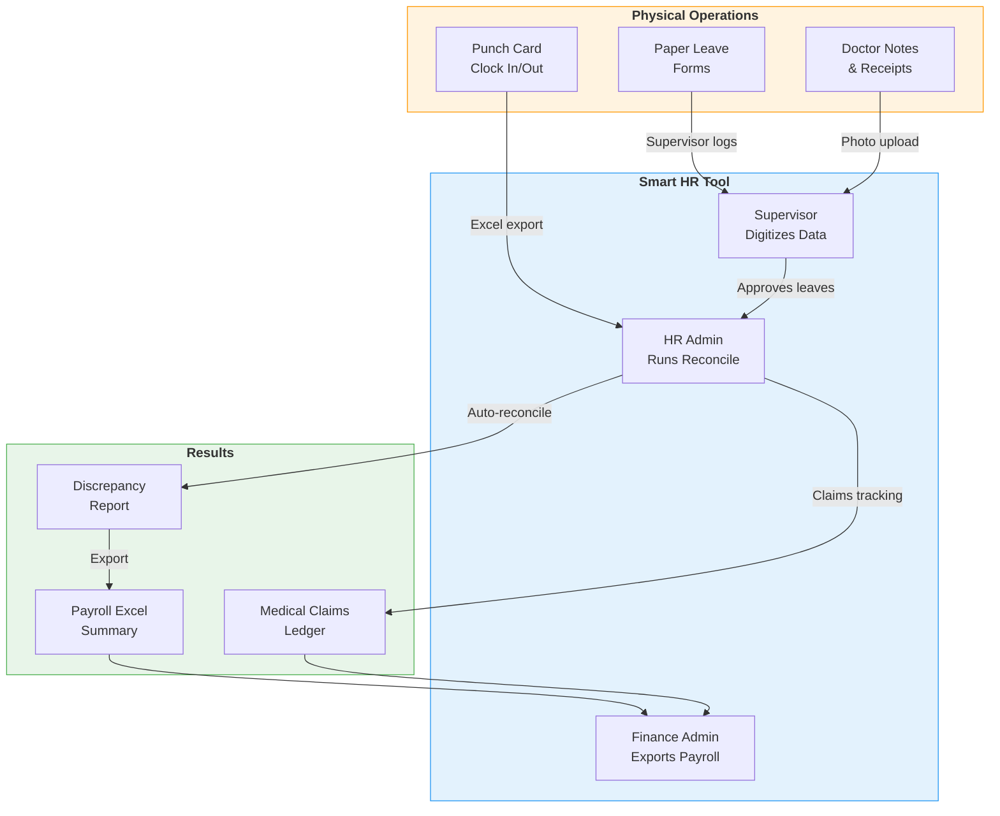
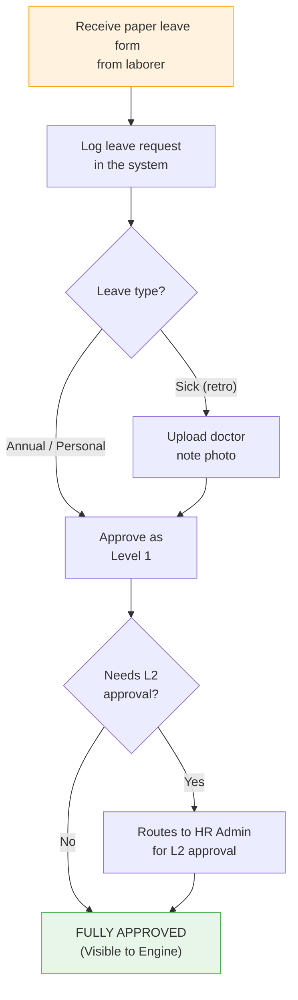
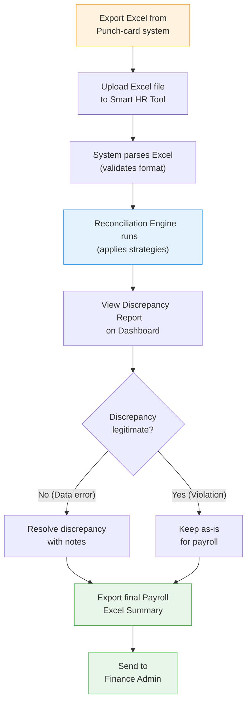
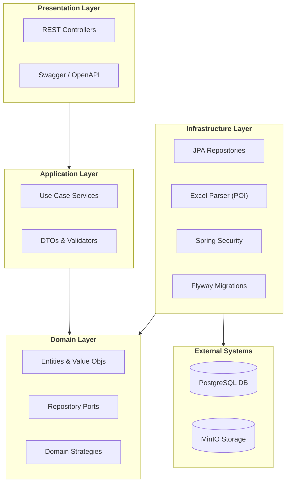
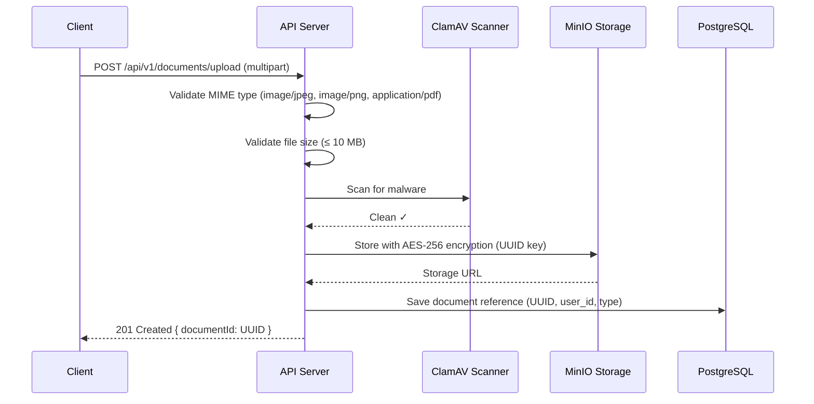
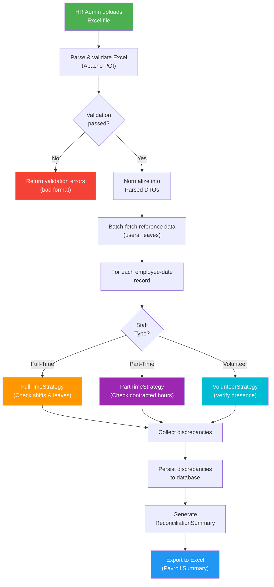
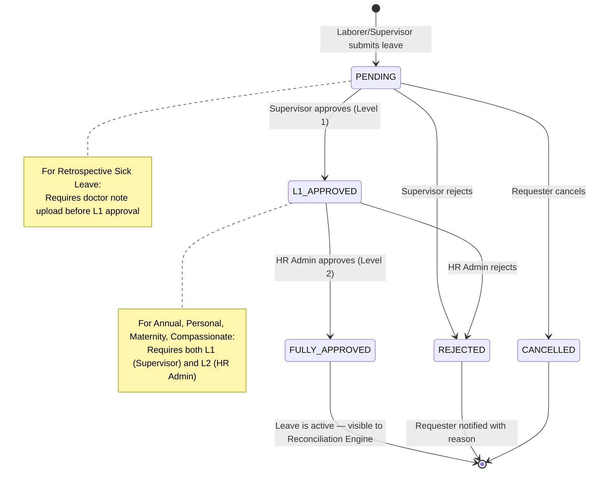
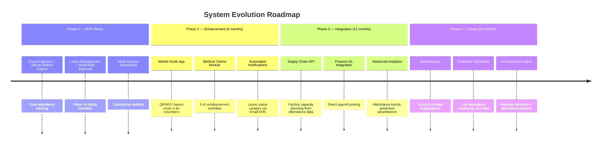

# Smart HR Attendance & Reconciliation Tool
## Technical System Design Proposal

> **Prepared by:** Clairine Christabel Lim  
> **Date:** June 12, 2026  
> **Stack:** Java 17 · Spring Boot 3.x · PostgreSQL 15+

---

## How It Works — Usage Guide by Role

This system digitizes a **manual, 1-week reconciliation process** into an instant, automated workflow. Below is how each user role interacts with the system, step by step.

### End-to-End System Flow



---

### 👷 Role 1: Factory Laborer / Field Staff

> *Less tech-savvy — continues using physical punch cards and paper forms.*

| Step | Action | System |
|:--:|:--|:--|
| 1 | Clock in/out at factory via **punch card** or **kiosk** | Data captured in IM/punch-card system |
| 2 | Need time off → Fill out a **paper leave form** | Supervisor will digitize it |
| 3 | Returned from sick leave → Give **doctor note** to supervisor | Supervisor uploads photo |
| 4 | *(Optional)* View own attendance history via the app | `GET /api/v1/attendance/me` |

---

### 👨‍💼 Role 2: Supervisor / Manager

> *Tech-literate — the bridge between physical operations and digital system.*



**Daily tasks:**

| Step | Action | API Endpoint |
|:--:|:--|:--|
| 1 | Log attendance manually for laborers who forgot to punch | `POST /api/v1/attendance/manual` |
| 2 | Submit leave on behalf of a laborer | `POST /api/v1/leaves` |
| 3 | Upload supporting documents (doctor notes, receipts) | `POST /api/v1/leaves/{id}/documents` |
| 4 | Approve or reject leave requests (Level 1) | `PUT /api/v1/leaves/{id}/approve` |
| 5 | Submit medical claims on behalf of laborers | `POST /api/v1/medical-claims` |
| 6 | View team attendance dashboard by location | `GET /api/v1/dashboard/locations/{id}` |

---

### 🧑‍💻 Role 3: HR Admin (Power User)

> *The primary user — runs reconciliation, manages the entire workforce.*



**Step-by-step reconciliation workflow:**

| Step | Action | API Endpoint |
|:--:|:--|:--|
| 1 | Export daily/monthly Excel from the IM/Punch-card system | *(External system)* |
| 2 | Upload the Excel file to the Smart HR Tool | `POST /api/v1/reconciliation/run` |
| 3 | System automatically parses, validates, and runs reconciliation | *(Automated — returns summary)* |
| 4 | Review discrepancies on the dashboard | `GET /api/v1/reconciliation/runs/{id}/discrepancies` |
| 5 | Resolve false positives with notes (e.g., "verbal approval from floor manager") | `PUT /api/v1/reconciliation/discrepancies/{id}/resolve` |
| 6 | Export the final summary as an Excel for payroll | `GET /api/v1/reconciliation/runs/{id}/export` |
| 7 | Approve Level 2 leave requests (Annual, Personal, etc.) | `PUT /api/v1/leaves/{id}/approve` |
| 8 | Review medical claims from supervisors | `PUT /api/v1/medical-claims/{id}/review` |
| 9 | Manage user profiles, locations, shift schedules | `POST/PUT /api/v1/users` |

---

### 💰 Role 4: Finance Admin

> *Consumes the output — uses reconciliation data for payroll and reimbursements.*

| Step | Action | API Endpoint |
|:--:|:--|:--|
| 1 | View completed reconciliation results | `GET /api/v1/reconciliation/runs` |
| 2 | Export consolidated payroll data for a date range | `GET /api/v1/reports/payroll-export` |
| 3 | Review approved medical claims | `GET /api/v1/medical-claims` |
| 4 | Mark claims as reimbursed after payment | `PUT /api/v1/medical-claims/{id}/reimburse` |

---

### Multi-Location Filtering

All dashboards and reports support filtering by operational site. Location types are configurable:

| Type | Description | Example |
|:--|:--|:--|
| Factory | Production facilities | Main production site |
| Logistics | Warehouses and distribution | Shipping warehouse |
| Retail | Customer-facing shops | Street-level shop |
| Vending | Vending machine locations | Mall vending area |

---

## Table of Contents

1. [System Architecture & Tech Stack](#1-system-architecture--tech-stack)
2. [Database Schema (ERD Design)](#2-database-schema-erd-design)
3. [Core Reconciliation Algorithm Logic](#3-core-reconciliation-algorithm-logic)
4. [API Endpoint Design](#4-api-endpoint-design)
5. [Role-Based Access Control (RBAC)](#5-role-based-access-control-rbac)
6. [Proof of Concept (PoC) Code](#6-proof-of-concept-poc-code)

---

## 1. System Architecture & Tech Stack

### 1.1 High-Level Architecture — Clean / Hexagonal Architecture

The system follows **Clean Architecture** (Hexagonal / Ports & Adapters) to maximize separation of concerns, testability, and future extensibility. Each layer has a single direction of dependency — inner layers never depend on outer layers.



> [!IMPORTANT]
> **Why Clean Architecture?** This factory HR tool will grow from a simple reconciliation engine to a full-fledged workforce management platform. Clean Architecture ensures the core business logic (reconciliation rules, leave policies) remains untouched even as the infrastructure evolves — for example, migrating from Excel ingestion to direct API integration with a future punch-card vendor.

### 1.2 Tech Stack Justification

| Component | Technology | Rationale |
|:--|:--|:--|
| **Runtime** | Java 17 + Spring Boot 3.3 | Enterprise-grade ecosystem ideal for HR/payroll. Spring's IoC container enforces SOLID principles naturally. Strong typing catches business logic errors at compile time. |
| **Database** | PostgreSQL 15+ | ACID-compliant for payroll accuracy. Excellent `JSONB` support for flexible metadata. Window functions for attendance analytics. Row-Level Security for future multi-tenancy. |
| **ORM** | Spring Data JPA / Hibernate 6 | Reduces boilerplate, built-in auditing (`@CreatedDate`, `@LastModifiedDate`), optimistic locking for concurrent approvals. |
| **Excel Parsing** | Apache POI 5.x | Industry standard for `.xls`/`.xlsx` ingestion. Streaming API (`SXSSFWorkbook`) handles large files without OOM. |
| **File Storage** | MinIO (S3-compatible) | Self-hosted object storage for doctor notes and receipts. Zero-change migration path to AWS S3 when scaling. |
| **Authentication** | Spring Security 6 + JWT | Stateless auth suitable for REST APIs, future mobile/kiosk clients, and machine-to-machine integration. |
| **DB Migration** | Flyway | Version-controlled schema evolution. Every schema change is auditable and reproducible. |
| **API Documentation** | SpringDoc OpenAPI 3.0 | Auto-generated Swagger UI for integration partners (Supply Chain, Finance GL). |
| **Build Tool** | Maven 3.9+ | Standard Java build tool with reproducible builds. |
| **Caching** | Spring Cache + Caffeine | In-process caching for reference data (locations, shift templates). Redis can be added later. |

### 1.3 Security Design — STRIDE Threat Model

| STRIDE Threat | Attack Vector | Mitigation Strategy |
|:--|:--|:--|
| **S — Spoofing** | Attacker impersonates HR admin | JWT-based authentication with RS256 signing. Short-lived access tokens (15 min) + refresh tokens. API keys with HMAC for M2M calls. |
| **T — Tampering** | Modified Excel uploads, altered leave records | SHA-256 checksum verification on uploads. Bean Validation (`@Valid`) on all inputs. DB-level constraints and optimistic locking (`@Version`). |
| **R — Repudiation** | User denies approving a leave | Comprehensive `audit_logs` table. All state mutations record actor ID, timestamp, old/new values. Immutable audit trail. |
| **I — Information Disclosure** | Unauthorized access to medical documents | TLS 1.3 in transit. AES-256 encryption at rest for MinIO objects. Field-level access control — laborers cannot see other employees' medical claims. |
| **D — Denial of Service** | Large file upload flood, API abuse | Bucket4j rate limiting (100 req/min per user). Max upload size: 10 MB. Async processing for large Excel files via `@Async`. |
| **E — Elevation of Privilege** | Laborer accesses HR admin endpoints | RBAC with `@PreAuthorize` method-level annotations. JWT claims verified per request. Principle of least privilege enforced at every layer. |

#### Document Upload Security Flow



---

## 2. Database Schema (ERD Design)

### 2.1 Entity-Relationship Diagram

```mermaid
erDiagram
    USERS ||--o{ ATTENDANCE_LOGS : "records"
    USERS ||--o{ LEAVE_REQUESTS : "submits"
    USERS ||--o{ LEAVE_APPROVALS : "decides"
    USERS ||--o{ MEDICAL_CLAIMS : "files"
    USERS ||--o{ RECONCILIATION_DISCREPANCIES : "flagged_for"
    USERS ||--o{ VOLUNTEER_ASSIGNMENTS : "assigned_to"
    USERS }o--|| LOCATIONS : "primary_location"

    LOCATIONS ||--o{ ATTENDANCE_LOGS : "recorded_at"
    LOCATIONS ||--o{ VOLUNTEER_ASSIGNMENTS : "hosts"

    LEAVE_REQUESTS ||--o{ LEAVE_APPROVALS : "requires"

    RECONCILIATION_RUNS ||--o{ RECONCILIATION_DISCREPANCIES : "produces"
    USERS ||--o{ RECONCILIATION_RUNS : "initiated_by"

    USERS {
        UUID id PK
        VARCHAR employee_id UK "e.g. EMP-00142"
        VARCHAR full_name
        VARCHAR email
        VARCHAR phone
        ENUM staff_type "FULL_TIME | PART_TIME | VOLUNTEER"
        ENUM role "LABORER | SUPERVISOR | HR_ADMIN | FINANCE_ADMIN"
        UUID primary_location_id FK
        TIME default_shift_start "e.g. 08:00"
        TIME default_shift_end "e.g. 17:00"
        DECIMAL contracted_hours_per_day "For PART_TIME"
        BOOLEAN is_active
        TIMESTAMP created_at
        TIMESTAMP updated_at
    }

    LOCATIONS {
        UUID id PK
        VARCHAR name "e.g. Sha Tin Factory"
        ENUM location_type "FACTORY | LOGISTICS | RETAIL"
        VARCHAR address
        VARCHAR district "e.g. Sha Tin, Sham Shui Po"
        BOOLEAN is_active
        TIMESTAMP created_at
    }

    ATTENDANCE_LOGS {
        UUID id PK
        UUID user_id FK
        UUID location_id FK
        DATE attendance_date
        TIMESTAMP clock_in
        TIMESTAMP clock_out
        DECIMAL hours_worked "Computed"
        ENUM source "PUNCH_CARD | IM_LOG | KIOSK | MANUAL"
        VARCHAR raw_data_reference "Row ref in source Excel"
        TIMESTAMP created_at
    }

    LEAVE_REQUESTS {
        UUID id PK
        UUID user_id FK
        ENUM leave_type "ANNUAL | SICK | PERSONAL | MATERNITY | COMPASSIONATE | UNPAID"
        DATE start_date
        DATE end_date
        BOOLEAN is_retrospective "true for after-the-fact sick leave"
        ENUM status "PENDING | L1_APPROVED | FULLY_APPROVED | REJECTED | CANCELLED"
        VARCHAR supporting_doc_url "MinIO reference for doctor notes"
        TEXT reason
        TIMESTAMP created_at
        TIMESTAMP updated_at
    }

    LEAVE_APPROVALS {
        UUID id PK
        UUID leave_request_id FK
        UUID approver_id FK
        INT approval_level "1 = Supervisor, 2 = HR Admin"
        ENUM decision "PENDING | APPROVED | REJECTED"
        TEXT comments
        TIMESTAMP decided_at
    }

    MEDICAL_CLAIMS {
        UUID id PK
        UUID user_id FK
        DATE claim_date
        DECIMAL amount "HKD"
        VARCHAR receipt_url "MinIO reference"
        ENUM status "SUBMITTED | UNDER_REVIEW | APPROVED | REJECTED | REIMBURSED"
        UUID reviewed_by FK
        TEXT notes
        TIMESTAMP created_at
        TIMESTAMP updated_at
    }

    RECONCILIATION_RUNS {
        UUID id PK
        UUID processed_by FK "HR Admin who triggered"
        VARCHAR source_file_name
        VARCHAR source_file_checksum "SHA-256"
        DATE period_start
        DATE period_end
        INT total_records_processed
        INT discrepancy_count
        ENUM status "PROCESSING | COMPLETED | FAILED"
        TIMESTAMP started_at
        TIMESTAMP completed_at
    }

    RECONCILIATION_DISCREPANCIES {
        UUID id PK
        UUID run_id FK
        UUID user_id FK
        DATE discrepancy_date
        ENUM discrepancy_type "UNEXCUSED_ABSENCE | LATE_ARRIVAL | EARLY_DEPARTURE | MISSING_CLOCK_OUT | HOURS_MISMATCH"
        TIMESTAMP expected_time
        TIMESTAMP actual_time
        INT variance_minutes
        TEXT details
        BOOLEAN is_resolved "Manual override by HR"
        UUID resolved_by FK
        TEXT resolution_notes
        TIMESTAMP resolved_at
    }

    VOLUNTEER_ASSIGNMENTS {
        UUID id PK
        UUID user_id FK
        UUID location_id FK
        DATE assignment_date
        VARCHAR task_description
        BOOLEAN attended
        TIMESTAMP created_at
    }

    AUDIT_LOGS {
        UUID id PK
        UUID actor_id FK
        VARCHAR action "CREATE | UPDATE | DELETE | APPROVE | REJECT"
        VARCHAR entity_type "e.g. LeaveRequest"
        UUID entity_id
        JSONB old_value
        JSONB new_value
        VARCHAR ip_address
        TIMESTAMP created_at
    }
```



### 2.2 Design Decisions

| Decision | Rationale |
|:--|:--|
| **Single `users` table with `staff_type` enum** | Avoids table-per-type inheritance complexity. All shared attributes (name, location, role) live in one place. Type-specific logic is handled at the service layer via the Strategy Pattern. |
| **`contracted_hours_per_day` on `users`** | Only applicable to `PART_TIME` staff. `NULL` for others. Keeps the schema simple without a separate part-time config table. |
| **Separate `volunteer_assignments` table** | Volunteers (100+ daily, changing locations) need a many-to-many relationship with locations by date. This cannot be modeled with a single `primary_location_id`. |
| **`is_retrospective` flag on `leave_requests`** | Distinguishes pre-approved leave from after-the-fact sick leave (which requires doctor note upload). Enables different validation rules. |
| **`raw_data_reference` on `attendance_logs`** | Traceability back to the exact row in the source Excel. Critical for auditing discrepancies. |
| **`JSONB` on `audit_logs`** | Flexible storage for old/new values of any entity type. Avoids explosion of audit tables. PostgreSQL JSONB supports indexing for query performance. |

### 2.3 SQL DDL (Flyway Migration)

The complete SQL DDL is provided in the PoC codebase at:

`src/main/resources/db/migration/V1__init_schema.sql`

> [!TIP]
> The DDL uses PostgreSQL-native `UUID` generation (`gen_random_uuid()`), custom `ENUM` types for type safety, and composite indexes on frequently queried columns (e.g., `(user_id, attendance_date)` on `attendance_logs`).

---

## 3. Core Reconciliation Algorithm Logic

### 3.1 Algorithm Overview

The Automated Reconciliation Engine is the core value proposition of this system. It replaces a **1-week manual cross-referencing process** with an **instant, automated analysis**.



### 3.2 Step-by-Step Algorithm Breakdown

#### Step 1 — Excel Parsing & Validation

```
Input:  Raw Excel file (.xlsx) from IM/Punch-card system
Output: List<ParsedAttendanceRecord> or ValidationException
```

- Apache POI's `XSSFWorkbook` reads the uploaded file
- The parser expects standard columns: `Employee ID`, `Date`, `Clock In`, `Clock Out`, `Location`
- Each row is mapped to a `ParsedAttendanceRecord` DTO
- Validation checks:
  - Required columns present
  - Date formats parseable
  - Employee IDs are non-empty strings
  - No duplicate `(employee_id, date)` pairs
- Invalid rows are collected and returned as a structured error report — the process does not fail silently

#### Step 2 — Reference Data Batch Loading (N+1 Prevention)

```
Input:  Set<employeeId>, dateRange (min/max from parsed records)
Output: Map<employeeId, User>, Map<userId, List<LeaveRequest>>
```

- **Critical for performance**: Instead of querying per-record (N+1), we batch-fetch:
  - All `User` entities matching the employee IDs in the file
  - All `FULLY_APPROVED` leave requests overlapping the date range
- Results are indexed into `HashMap` lookups for O(1) access during reconciliation
- Unknown employee IDs (present in Excel but not in DB) are flagged immediately

#### Step 3 — Per-Record Cross-Referencing (Strategy Pattern)

For each `ParsedAttendanceRecord`, the engine:

1. **Resolves the User** — looks up the employee in the pre-fetched map
2. **Selects the Strategy** — based on `user.staffType`, dispatches to the appropriate `ReconciliationStrategy` implementation
3. **Executes the Strategy** — the strategy returns a list of `ReconciliationDiscrepancy` entities (possibly empty if no issues found)

**Full-Time Strategy Logic:**

| Check | Condition | Discrepancy Type |
|:--|:--|:--|
| No clock-in, no leave | `clockIn == null && !isOnApprovedLeave` | `UNEXCUSED_ABSENCE` |
| Late arrival | `clockIn > shiftStart + 15 min` | `LATE_ARRIVAL` |
| Early departure | `clockOut < shiftEnd - 15 min` | `EARLY_DEPARTURE` |
| Missing clock-out | `clockIn != null && clockOut == null` | `MISSING_CLOCK_OUT` |
| On approved leave | `isOnApprovedLeave == true` | *(no discrepancy)* |

**Part-Time Strategy Logic:**

| Check | Condition | Discrepancy Type |
|:--|:--|:--|
| Hours mismatch | `\|hoursWorked - contractedHours\| > 0.5` | `HOURS_MISMATCH` |
| Missing clock-out | `clockIn != null && clockOut == null` | `MISSING_CLOCK_OUT` |

**Volunteer Strategy Logic:**

| Check | Condition | Discrepancy Type |
|:--|:--|:--|
| No attendance | `clockIn == null && assigned == true` | `UNEXCUSED_ABSENCE` |
| Location mismatch | `recordedLocation != assignedLocation` | `LOCATION_MISMATCH` |

#### Step 4 — Persistence & Summary Generation

- All discrepancies are batch-inserted via `saveAll()` (single DB round-trip)
- The `ReconciliationRun` record is updated with:
  - `discrepancy_count` — total issues found
  - `status = COMPLETED`
  - `completed_at` — timestamp
- A `ReconciliationSummary` DTO is built containing:
  - Run metadata (file name, date range, who ran it)
  - Breakdown by discrepancy type (counts)
  - Breakdown by location
  - Top offenders list (employees with most discrepancies)
  - List of all individual discrepancies

#### Step 5 — Excel Export

- The summary is exportable as a "Simple Excel Summary" for payroll
- Columns: Employee ID, Name, Date, Status (Present/Absent/Late), Hours Worked, Notes
- One sheet per location for easy filtering

---

## 4. API Endpoint Design

### 4.1 Base URL

```
https://api.smarthr.local/api/v1
```

All endpoints require JWT authentication unless noted. Responses follow a standard envelope:

```json
{
  "success": true,
  "data": { ... },
  "error": null,
  "timestamp": "2026-06-12T10:30:00Z"
}
```

### 4.2 Endpoint Catalog

#### Data Ingestion

| Method | Endpoint | Description | Role |
|:--|:--|:--|:--|
| `POST` | `/ingestion/attendance` | Upload Excel attendance file. Returns a run ID for tracking. | HR_ADMIN |
| `GET` | `/ingestion/history` | List past file uploads with status and result summary. | HR_ADMIN |
| `GET` | `/ingestion/{runId}/status` | Poll the status of an in-progress ingestion/reconciliation. | HR_ADMIN |

#### Attendance Management

| Method | Endpoint | Description | Role |
|:--|:--|:--|:--|
| `GET` | `/attendance` | List attendance logs with filters (date, location, user, staff type). Paginated. | SUPERVISOR+ |
| `GET` | `/attendance/me` | View own attendance history. | ALL |
| `GET` | `/attendance/users/{userId}` | View a specific employee's attendance. | SUPERVISOR+ |
| `POST` | `/attendance/manual` | Manually log attendance on behalf of a laborer. | SUPERVISOR+ |

#### Leave Management

| Method | Endpoint | Description | Role |
|:--|:--|:--|:--|
| `POST` | `/leaves` | Submit a new leave request (pre-approval or retrospective). | ALL |
| `GET` | `/leaves` | List leave requests with filters. Supervisors see their team; HR sees all. | ALL |
| `GET` | `/leaves/{id}` | View leave request detail including approval chain. | ALL (own) / SUPERVISOR+ (team) |
| `PUT` | `/leaves/{id}/approve` | Approve a leave request (level-appropriate). | SUPERVISOR, HR_ADMIN |
| `PUT` | `/leaves/{id}/reject` | Reject a leave request with comments. | SUPERVISOR, HR_ADMIN |
| `POST` | `/leaves/{id}/documents` | Upload supporting documents (doctor notes, receipts). | ALL |
| `DELETE` | `/leaves/{id}` | Cancel a pending leave request. | ALL (own only) |

#### Reconciliation

| Method | Endpoint | Description | Role |
|:--|:--|:--|:--|
| `POST` | `/reconciliation/run` | Trigger a reconciliation run on a previously ingested file. | HR_ADMIN |
| `GET` | `/reconciliation/runs` | List all reconciliation runs with summary stats. | HR_ADMIN |
| `GET` | `/reconciliation/runs/{id}` | Get detailed run result including all discrepancies. | HR_ADMIN |
| `GET` | `/reconciliation/runs/{id}/discrepancies` | Paginated list of discrepancies for a run. Filterable by type, location, user. | HR_ADMIN |
| `PUT` | `/reconciliation/discrepancies/{id}/resolve` | Manually resolve/override a discrepancy with notes. | HR_ADMIN |
| `GET` | `/reconciliation/runs/{id}/export` | Download the reconciliation summary as an Excel file. | HR_ADMIN, FINANCE_ADMIN |

#### Medical Claims

| Method | Endpoint | Description | Role |
|:--|:--|:--|:--|
| `POST` | `/medical-claims` | Submit a new medical claim with receipt upload. | SUPERVISOR+ (on behalf) |
| `GET` | `/medical-claims` | List claims. Filtered by status, user, date range. | HR_ADMIN, FINANCE_ADMIN |
| `GET` | `/medical-claims/{id}` | View claim detail and receipt. | HR_ADMIN, FINANCE_ADMIN |
| `PUT` | `/medical-claims/{id}/review` | Approve or reject a medical claim. | HR_ADMIN |
| `PUT` | `/medical-claims/{id}/reimburse` | Mark a claim as reimbursed (post-payment). | FINANCE_ADMIN |

#### Dashboard & Reporting

| Method | Endpoint | Description | Role |
|:--|:--|:--|:--|
| `GET` | `/dashboard/summary` | Overview stats: total staff, attendance rate, pending leaves, open claims. | SUPERVISOR+ |
| `GET` | `/dashboard/locations/{locationId}` | Location-specific attendance summary and staff count. | SUPERVISOR+ |
| `GET` | `/dashboard/locations` | List all locations with current-day stats. | SUPERVISOR+ |
| `GET` | `/reports/payroll-export` | Generate consolidated payroll data for a date range. | FINANCE_ADMIN |

#### User & Location Management

| Method | Endpoint | Description | Role |
|:--|:--|:--|:--|
| `GET` | `/users` | List users with filters (role, staff type, location, active status). | HR_ADMIN |
| `POST` | `/users` | Create a new user profile. | HR_ADMIN |
| `PUT` | `/users/{id}` | Update user profile (location, shift, role). | HR_ADMIN |
| `GET` | `/locations` | List all operational locations. | ALL |

---

## 5. Role-Based Access Control (RBAC)

### 5.1 Permission Matrix

| Feature / Action | LABORER | SUPERVISOR | HR_ADMIN | FINANCE_ADMIN |
|:--|:--:|:--:|:--:|:--:|
| View own attendance | ✅ | ✅ | ✅ | ✅ |
| View team attendance | ❌ | ✅ | ✅ | ❌ |
| View all attendance | ❌ | ❌ | ✅ | ❌ |
| Manual attendance entry | ❌ | ✅ | ✅ | ❌ |
| Submit own leave | ✅ | ✅ | ✅ | ✅ |
| Submit leave on behalf | ❌ | ✅ | ✅ | ❌ |
| Approve leave (Level 1) | ❌ | ✅ | ✅ | ❌ |
| Approve leave (Level 2) | ❌ | ❌ | ✅ | ❌ |
| Upload documents | ✅ | ✅ | ✅ | ✅ |
| Upload Excel / Ingest data | ❌ | ❌ | ✅ | ❌ |
| Trigger reconciliation | ❌ | ❌ | ✅ | ❌ |
| View reconciliation results | ❌ | ❌ | ✅ | ✅ |
| Resolve discrepancies | ❌ | ❌ | ✅ | ❌ |
| Export payroll summary | ❌ | ❌ | ✅ | ✅ |
| Submit medical claim | ❌ | ✅ | ✅ | ❌ |
| Review medical claims | ❌ | ❌ | ✅ | ❌ |
| Reimburse medical claims | ❌ | ❌ | ❌ | ✅ |
| View dashboard | ❌ | ✅ | ✅ | ✅ |
| Manage users | ❌ | ❌ | ✅ | ❌ |

### 5.2 Multi-Level Approval Flow



**Approval Rules:**

| Leave Type | Level 1 (Supervisor) | Level 2 (HR Admin) | Doctor Note Required |
|:--|:--:|:--:|:--:|
| Annual Leave | ✅ | ✅ | ❌ |
| Sick Leave (pre-approved) | ✅ | ❌ | ❌ |
| Sick Leave (retrospective) | ✅ | ❌ | ✅ |
| Personal Leave | ✅ | ✅ | ❌ |
| Maternity Leave | ✅ | ✅ | ✅ |
| Compassionate Leave | ✅ | ✅ | ❌ |
| Unpaid Leave | ✅ | ✅ | ❌ |

### 5.3 Implementation via Spring Security

```java
@Configuration
@EnableMethodSecurity(prePostEnabled = true)
public class SecurityConfig {

    @Bean
    public SecurityFilterChain filterChain(HttpSecurity http) throws Exception {
        http
            .authorizeHttpRequests(auth -> auth
                .requestMatchers("/api/v1/auth/**").permitAll()
                .requestMatchers("/api/v1/ingestion/**").hasRole("HR_ADMIN")
                .requestMatchers("/api/v1/reconciliation/**").hasAnyRole("HR_ADMIN", "FINANCE_ADMIN")
                .requestMatchers("/api/v1/users/**").hasRole("HR_ADMIN")
                .anyRequest().authenticated()
            )
            .addFilterBefore(jwtFilter, UsernamePasswordAuthenticationFilter.class);
        return http.build();
    }
}
```

Method-level enforcement example:
```java
@PreAuthorize("hasRole('HR_ADMIN') or (hasRole('SUPERVISOR') and @teamService.isTeamMember(#userId))")
public AttendanceLog getAttendanceForUser(UUID userId) { ... }
```

---

## 6. Proof of Concept (PoC) Code

### 6.1 Architecture Overview

The PoC code is a fully structured Spring Boot project demonstrating the **Automated Reconciliation Engine**. The code lives in the `smart-hr-tool/` directory with the following package structure:

```
com.smarthr.attendance
├── SmartHrAttendanceApplication.java          — Spring Boot entry point
│
├── domain/
│   ├── entity/                                — JPA entities (User, AttendanceLog, etc.)
│   ├── enums/                                 — Type-safe enumerations
│   └── repository/                            — Spring Data JPA repository interfaces
│
├── application/
│   ├── dto/                                   — Data Transfer Objects
│   └── service/
│       ├── ReconciliationService.java         — ★ Core orchestrator
│       ├── ExcelParsingService.java           — Excel ingestion facade
│       └── strategy/
│           ├── ReconciliationStrategy.java    — Strategy interface (OCP)
│           ├── FullTimeReconciliationStrategy  — Strict attendance rules
│           ├── PartTimeReconciliationStrategy  — Hours-based tracking
│           └── VolunteerReconciliationStrategy — Presence verification
│
├── infrastructure/
│   ├── parser/ApachePoiExcelParser.java       — Apache POI implementation
│   └── config/SecurityConfig.java             — RBAC configuration
│
└── presentation/
    └── controller/ReconciliationController.java — REST endpoints
```

### 6.2 Key Design Patterns Used

| Pattern | Where | Why |
|:--|:--|:--|
| **Strategy** | `ReconciliationStrategy` + 3 implementations | Open/Closed Principle — new staff types (e.g., contractors) can be added without modifying the core engine. |
| **Dependency Injection** | All service constructors | Dependency Inversion Principle — services depend on abstractions (repository interfaces), not JPA implementations. |
| **DTO / Data Mapper** | `ParsedAttendanceRecord`, `ReconciliationSummary` | Separates external data shapes from internal domain models. |
| **Template Method** | Base reconciliation flow in `ReconciliationService.reconcile()` | The orchestration steps are fixed; only the per-record logic varies by strategy. |
| **Repository** | Spring Data JPA interfaces | Encapsulates data access; domain layer doesn't know about SQL or JPA. |

### 6.3 How to Read the Code

Start with these files in order:

1. **`ReconciliationService.java`** — The heart of the system. Read the `reconcile()` method top-to-bottom. Each step is heavily commented.
2. **`FullTimeReconciliationStrategy.java`** — The most complex strategy. Shows exactly how clock-in/out times are compared against shifts and leaves.
3. **`ExcelParsingService.java`** + **`ApachePoiExcelParser.java`** — Shows how raw Excel data enters the system.
4. **`ReconciliationController.java`** — Shows how the REST API triggers the engine.

### 6.4 SOLID Principles Mapping

| Principle | Implementation |
|:--|:--|
| **S** — Single Responsibility | `ExcelParsingService` only parses. `ReconciliationService` only reconciles. Each strategy handles one staff type. |
| **O** — Open/Closed | New staff types → add a new `ReconciliationStrategy` implementation. No existing code changes. |
| **L** — Liskov Substitution | All strategies implement the same `ReconciliationStrategy` interface and are interchangeable. |
| **I** — Interface Segregation | Repository interfaces expose only the query methods needed. No "god repository." |
| **D** — Dependency Inversion | Services depend on repository interfaces (defined in domain layer), not JPA implementations (infrastructure layer). |

---

## Appendix A — Long-Term Architecture Roadmap



---

> [!NOTE]
> The PoC code is intentionally focused on the reconciliation engine — the core problem solver. Production deployment would additionally require: JWT authentication filter implementation, comprehensive exception handling, pagination for list endpoints, API versioning headers, and observability (Micrometer + Prometheus metrics). These are standard Spring Boot patterns and can be layered on without modifying the core business logic, thanks to the Clean Architecture boundaries.
